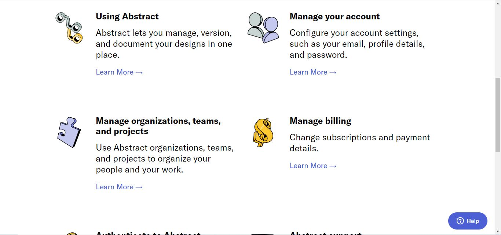

# _Clonación de la página Abstract Studio_

_En el presente maquetado que forma parte del grupo de ejercicios de la página Fronted Practice se realizó la clonación de la página oficial de Abstract Studio cuyo enlace es el siguiente https://help.abstract.com/hc/en-us_

_Algunas imágenes de cada una de las secciones del ejercicio se muestran a continuación:_

[Abstract-Studio-image-3](assets/abstract-studio-image-3.JPG "Abstract-Studio-image-3")

[Abstract-Studio-image-4](assets/abstract-studio-image-4.JPG "Abstract-Studio-image-4")

[Abstract-Studio-image-5](assets/abstract-studio-image-5.JPG "Abstract-Studio-image-5")

[Abstract-Studio-image-6](assets/abstract-studio-image-6.JPG "Abstract-Studio-image-6")

[Abstract-Studio-image-7](assets/abstract-studio-image-7.JPG "Abstract-Studio-image-7")
